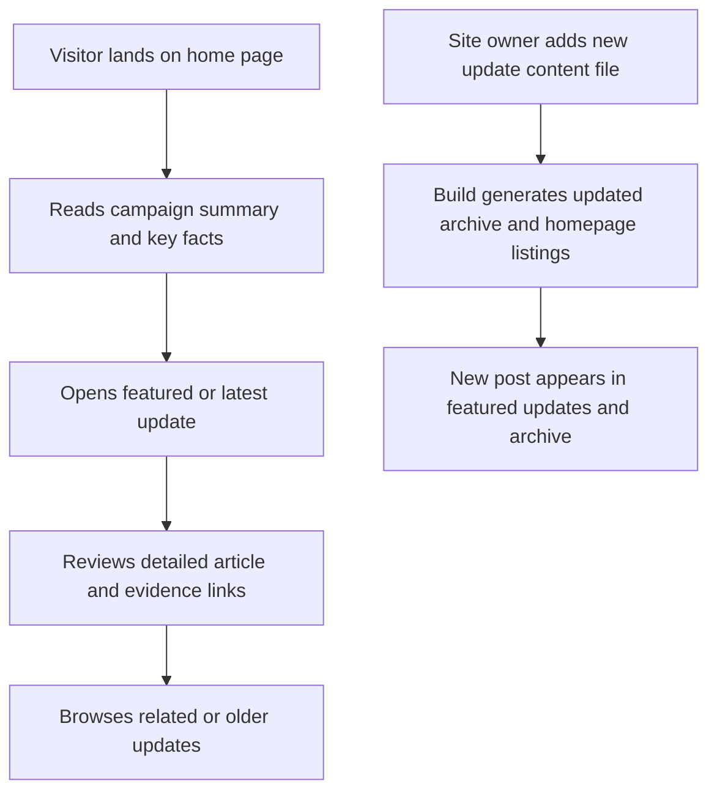

## 1. Product Overview
Wilton Road Campaign is a serious, community-led protest website for residents concerned about development activity at Number 27 Wilton Road, Redhill, RH1 6QR. It exists to present the issue clearly, publish updates in a blog-like format, and help visitors understand the timeline, planning context, and residents' concerns.

- Main purpose: explain the situation, document updates, and provide a trustworthy public record for neighbours, supporters, press, and local decision-makers
- Value: creates an organised, credible, and easy-to-maintain public-facing campaign presence on GitHub Pages without needing a backend

## 2. Core Features

### 2.1 Feature Module
1. **Home page**: campaign summary, key concerns, planning context, featured updates, and calls to follow the campaign
2. **Updates index**: chronological list of campaign posts with tags, dates, and short excerpts
3. **Update detail page**: full article content, evidence links, timeline references, and related updates

### 2.2 Page Details
| Page Name | Module Name | Feature description |
|-----------|-------------|---------------------|
| Home page | Hero and campaign statement | Clear headline, precise location context, serious supporting copy, and a concise statement of concern |
| Home page | Key facts panel | High-trust summary of known facts, planning permission context, and a short note distinguishing confirmed facts from resident concerns |
| Home page | Timeline preview | Compact timeline showing major milestones and latest developments |
| Home page | Featured updates | Displays the most recent or most important update posts with links to full articles |
| Home page | Evidence and process section | Explains how updates are sourced, verified, and phrased to maintain credibility |
| Updates index | Post list | Filters or tags for topics such as planning, construction activity, council contact, and resident response |
| Updates index | Archive navigation | Simple chronological browsing across all published updates |
| Update detail page | Article body | Long-form update content with title, publication date, summary, and optional evidence links |
| Update detail page | Related updates | Links to adjacent or related posts to help readers follow the story |
| Update detail page | Call to stay informed | Encourages visitors to check back for updates and follow the campaign trail |

## 3. Core Process
Visitors arrive on the home page, quickly understand the issue, review key facts and the current status, then move into the updates archive to read the latest developments in detail. The site owner publishes new updates by adding structured content files, which automatically appear on the homepage and archive in date order.

## 4. User Interface Design

### 4.1 Design Style
- Primary colors: charcoal, off-white, muted stone, and restrained deep red accents for emphasis
- Button style: understated rectangular buttons with crisp borders and strong contrast
- Fonts: distinctive editorial serif for headlines paired with a readable, serious sans-serif for body text
- Layout style: desktop-first editorial layout with strong hierarchy, structured columns, and compact content density
- Icon style suggestions: minimal line icons or no icons unless they clearly add meaning

### 4.2 Page Design Overview
| Page Name | Module Name | UI Elements |
|-----------|-------------|-------------|
| Home page | Hero and campaign statement | Bold editorial typography, strong headline, subtle texture, restrained accent line, and no gimmicky animation |
| Home page | Key facts panel | Structured fact boxes, status labels, and high-contrast evidence framing |
| Home page | Timeline preview | Vertical or stepped timeline with dates, short summaries, and visual markers |
| Home page | Featured updates | Dense article cards with date, title, excerpt, and topic tag |
| Updates index | Post list | Ordered list or compact cards with strong scanability and consistent metadata |
| Update detail page | Article body | Long-form reading layout, clear headings, pull quotes or note boxes, and linkable evidence references |

### 4.3 Responsiveness
Desktop-first design with tablet and mobile adaptation. On smaller screens, multi-column editorial sections stack cleanly while preserving hierarchy, metadata, and readability.

## 5. Content and Publishing Principles
- The site must distinguish clearly between confirmed facts, planning permission already granted, and resident concerns or suspicions still being investigated
- Copy should be calm, factual, and professional rather than emotional or sensational
- Each update should support chronology with dates, titles, optional tags, and evidence references where available
- Publishing a new post should be simple enough for the owner to do by editing a content file in the repository
