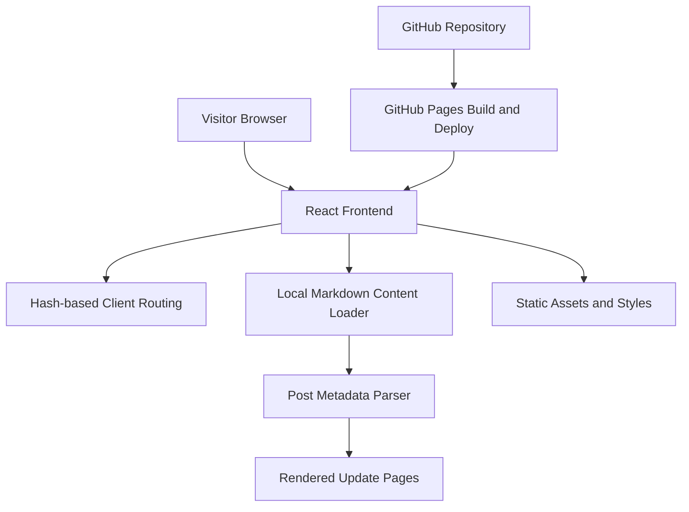

## 1. Architecture Design



## 2. Technology Description
- Frontend: React 18 + TypeScript + Vite
- Styling: Tailwind CSS 3 with custom design tokens for typography, color, spacing, and editorial components
- Routing: React Router with `HashRouter` for reliable GitHub Pages hosting without server-side rewrite rules
- Content system: local Markdown files with frontmatter stored in `src/content/posts/`
- Markdown rendering: `react-markdown`
- Frontmatter parsing: `gray-matter`
- Initialization Tool: Vite
- Backend: None
- Database: None, content is file-based and versioned in Git
- Deployment: GitHub Pages using static build output

## 3. Route Definitions
| Route | Purpose |
|-------|---------|
| /#/ | Home page with campaign overview, key facts, timeline preview, and featured updates |
| /#/updates | Updates archive listing all published posts in reverse chronological order |
| /#/updates/:slug | Individual campaign update page rendered from markdown content |

## 4. Content Model

### 4.1 Post Frontmatter Shape
```ts
type CampaignPost = {
  slug: string;
  title: string;
  date: string;
  summary: string;
  tags?: string[];
  featured?: boolean;
  status?: "confirmed" | "concern" | "process";
  relatedSlugs?: string[];
};
```

### 4.2 Markdown File Structure
Each post file should include frontmatter followed by Markdown body content.

```md
---
title: "Example update title"
date: "2026-07-31"
summary: "Short summary shown on cards and archive listings."
tags: ["planning", "resident update"]
featured: true
status: "process"
relatedSlugs: ["earlier-update"]
---

Full update content goes here.
```

## 5. Component Structure
- `AppShell`: global layout, navigation, and footer
- `HomePage`: hero, statement, fact panels, timeline preview, featured updates
- `UpdatesPage`: full archive with metadata and topic tags
- `UpdateArticlePage`: single article rendering, evidence references, related updates
- `FactCard`, `TimelineItem`, `PostCard`, `SectionHeader`: reusable display components
- `content/posts/*`: markdown-based post entries
- `lib/content.ts`: content loading, sorting, filtering, and slug lookup utilities

## 6. Data Flow
1. Build or runtime bootstrap loads markdown files from `src/content/posts/`
2. Frontmatter is parsed into structured metadata
3. Posts are sorted by date and exposed to page components
4. Homepage selects featured and recent posts
5. Archive page lists all posts
6. Detail route resolves a post by slug and renders markdown body

## 7. Design and Content Guardrails
- The implementation must communicate seriousness, credibility, and order rather than activist chaos or sensational styling
- The UI should clearly separate verified facts from community concerns using labels, notes, and consistent visual treatment
- Typography and spacing should feel like a local affairs or planning-watch publication
- The architecture must stay static-host-friendly so the site remains easy to deploy and maintain on GitHub Pages
